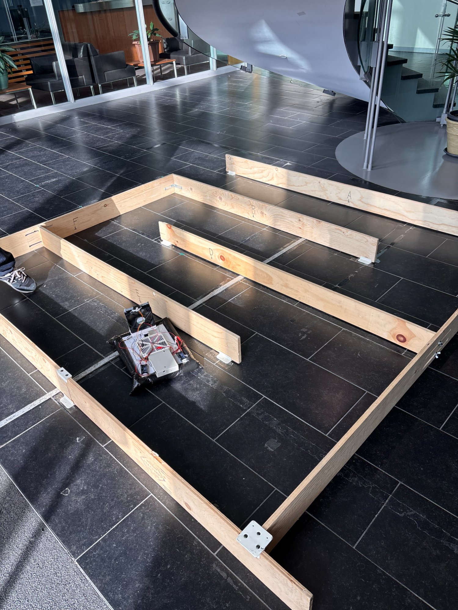
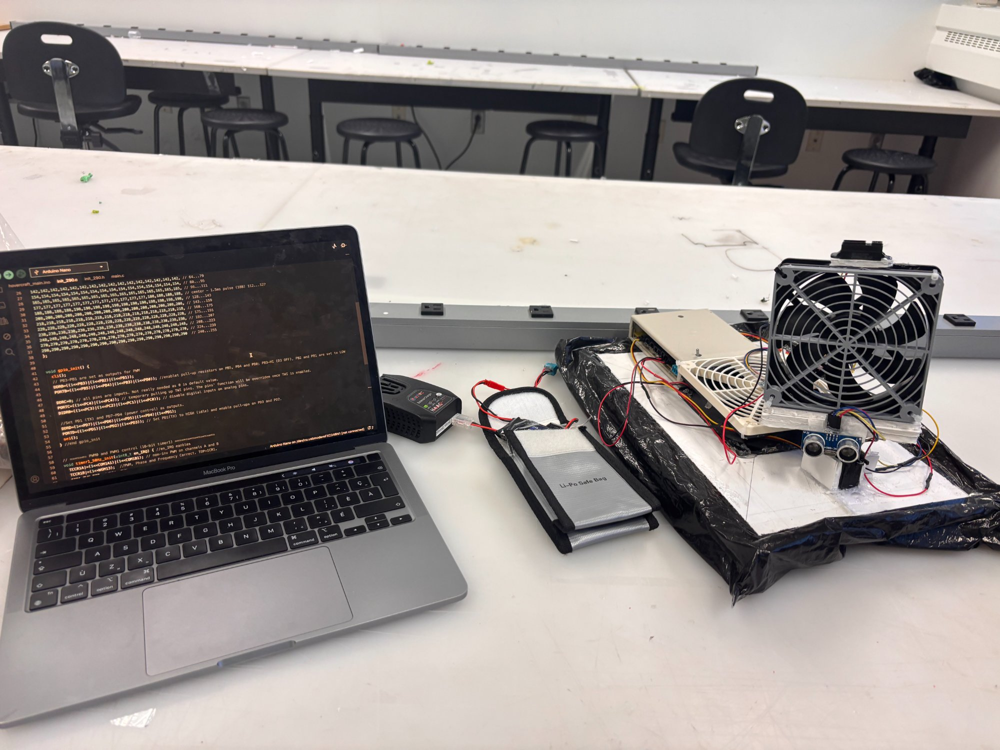
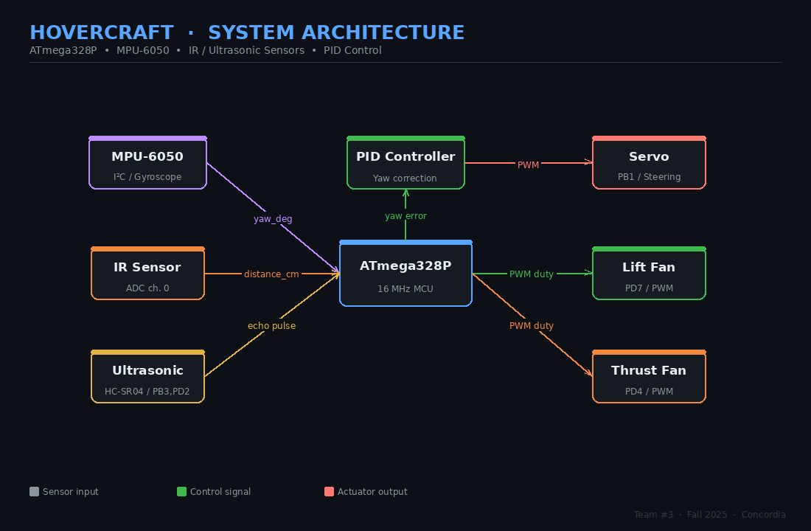
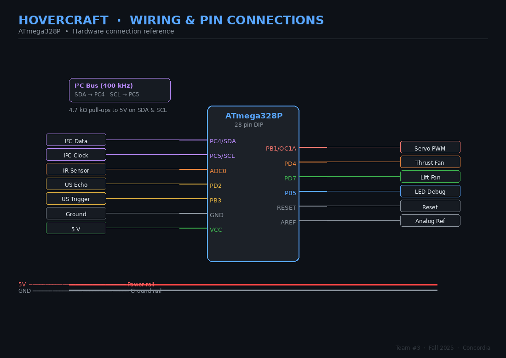

# Autonomous Maze-Navigating Hovercraft

Bare-metal embedded robotics project built on an **ATmega328P** in **C**, featuring **PID yaw control**, **MPU-6050 IMU integration**, and fully autonomous navigation of a physical maze.

---

## 🎥 Demo

### Maze Run


### Bench Testing


[▶️ Watch demo video](https://youtube.com/shorts/Qc1ewwDGVW8?feature=share)

---

## 🚀 Highlights

- **Bare-metal AVR firmware** — no Arduino libraries, direct register programming
- **Real-time PID heading control** using gyroscope (MPU-6050)
- **Multi-sensor integration** — IR + ultrasonic + IMU (I²C)
- **Autonomous navigation logic** — intersection handling, dead-end recovery, finish detection
- **Software PWM via Timer0 ISR** for dual fan control
- Full system design: hardware, firmware, control, and testing

---

## Overview

This project is a fully autonomous hovercraft built from scratch for an embedded systems course competition. The vehicle floats on an air cushion generated by a lift fan, uses a thrust fan with a servo-controlled nozzle for steering, and navigates a physical wooden maze without any human input. An ATmega328P microcontroller runs all sensing, control, and decision-making logic in bare-metal C — no RTOS, no Arduino libraries. The hovercraft drives straight using a real-time PID yaw controller fed by a gyroscope, detects walls with an IR distance sensor, scans intersections to choose the most open path, and halts automatically when an overhead finish bar is confirmed by an upward-facing ultrasonic sensor.

---

## Key Features

- **Gyroscope-assisted straight-line driving** — PID loop continuously corrects heading drift using integrated MPU-6050 yaw data
- **IR wall detection** — averaged Sharp GP2Y readings trigger stops and intersection handling
- **Greedy intersection solver** — servo sweeps left and right; hovercraft turns toward the more open side
- **Dead-end recovery** — detects blocked paths on both sides and executes a 180° U-turn
- **Upbar finish detection** — HC-SR04 ultrasonic confirms overhead bar over multiple consecutive reads before stopping
- **Software PWM** — 1 kHz Timer0 ISR drives both fans independently with no extra hardware
- **Bare-metal AVR** — no Arduino framework; direct register access throughout

---

## Hardware

| Component | Purpose |
|---|---|
| ATmega328P @ 16 MHz | Main microcontroller |
| MPU-6050 (I2C / TWI) | Gyroscope for yaw tracking and heading lock |
| Sharp GP2Y IR sensor | Front wall and obstacle distance measurement |
| HC-SR04 ultrasonic sensor | Upward-facing finish-bar detection |
| Hobby servo (PWM) | Thrust vectoring — steers by deflecting airflow |
| 120mm brushless lift fan | Generates air cushion to float the craft |
| Brushless thrust fan | Forward propulsion |
| LiPo battery pack | Onboard power supply |
| Foam board + plastic sheet | Hovercraft skirt and chassis |

---

## Software Architecture

```
autonomous-hovercraft/
├── README.md
├── Makefile              avr-gcc build and avrdude flash targets
├── config.h              All pin definitions, thresholds, and tuning constants
├── src/
│   ├── main.c            Entry point, 1 kHz systick ISR, software PWM, millis()
│   ├── imu.c             TWI driver, MPU-6050 init, gyro calibration, yaw integration
│   ├── sensors.c         ADC, IR distance sensor, HC-SR04 ultrasonic + upbar logic
│   ├── pid.c             PID yaw controller with anti-windup and filtered derivative
│   └── motion.c          Servo & fan control, turning, straight drive, intersection solver
├── include/
│   ├── imu.h
│   ├── sensors.h
│   ├── pid.h
│   └── motion.h
└── docs/
    ├── system_architecture.png
    └── wiring_diagram.png
```

All tunable parameters (PID gains, thresholds, pin assignments, duty cycles) live in `config.h` so nothing is buried in logic files.

---

## Navigation & Control Logic

```
┌─────────────────────────────────────┐
│         drive_straight_until_wall() │
│  - Lock yaw reference               │
│  - PID corrects servo every loop    │
│  - Check IR every 60 ms             │
│  - Check upbar → finish_stop()      │
└────────────┬────────────────────────┘
             │ IR ≤ OBSTACLE_THRESHOLD_CM
             ▼
┌─────────────────────────────────────┐
│         handle_intersection()       │
│  - Servo sweeps left → IR reading   │
│  - Servo sweeps right → IR reading  │
│  - Both blocked? → U-turn 180°      │
│  - Else → advance then turn toward  │
│            more open side           │
└─────────────────────────────────────┘
```

**PID heading lock** — `servo_from_yaw_error()` runs every main-loop iteration during straight driving. The derivative term is low-pass filtered (`YAW_D_LPF_ALPHA = 0.7`) to reduce servo jitter from noisy gyro data. Integral windup is clamped to ±`YAW_I_MAX`.

**Turn execution** — `turn_by_yaw()` resets the yaw accumulator to zero, commands the servo hard left or right, and spins the thrust fan until the integrated angle reaches the target (±5° tolerance) or a 3-second timeout fires.

**Key tuning constants (`config.h`):**

| Constant | Default | Description |
|---|---|---|
| `YAW_KP / KI / KD` | 3.0 / 0.1 / 0.8 | PID gains for heading correction |
| `OBSTACLE_THRESHOLD_CM` | 60 cm | Stop distance from front wall |
| `THRUST_CRUISE_DUTY` | 80% | Fan duty during straight driving |
| `UPBAR_THRESHOLD_CM` | 25 cm | Max distance to detect finish bar |
| `UPBAR_CONFIRM_COUNT` | 3 | Consecutive reads required to confirm bar |

---

## System Architecture



---

## Hardware Connections



| Pin | Connection | Notes |
|---|---|---|
| `PB1` (OC1A) | Servo | Timer1 hardware PWM, 50 Hz, 600–2400 µs pulse |
| `PD4` | Thrust fan | Software PWM via Timer0 ISR |
| `PD7` | Lift fan | Software PWM via Timer0 ISR |
| `PB3` | Ultrasonic trigger | 10 µs pulse output |
| `PD2` | Ultrasonic echo | Pulse-width input, measured in µs |
| `ADC0` (PC0) | IR sensor | Analog voltage → distance via curve fit |
| `PC4` (SDA) | MPU-6050 data | I²C at 400 kHz, 4.7 kΩ pull-up to 5V |
| `PC5` (SCL) | MPU-6050 clock | I²C at 400 kHz, 4.7 kΩ pull-up to 5V |
| `PB5` | Debug LED | Blinks on finish |

> **Power:** The MCU and logic run at 5V. The fans are driven at battery voltage through a separate MOSFET stage. The LiPo is connected through an ESC for each brushless fan.

---

## How to Build and Flash

**Requirements:** `avr-gcc`, `avr-libc`, `avrdude`

```bash
# Clone the repo
git clone https://github.com/yourusername/hovercraft.git
cd hovercraft

# Compile
make

# Flash via Arduino bootloader (adjust port as needed)
make flash

# Clean build artifacts
make clean
```

Default upload port is `/dev/ttyUSB0`. Edit the `PORT` variable in the `Makefile` if yours differs (e.g. `/dev/tty.usbmodem*` on macOS).

---

## Future Improvements

- **Left-hand-rule or flood-fill** — replace the greedy intersection solver with a proper maze algorithm to handle loops and revisited paths
- **Side-wall IR sensors** — add lateral distance sensing for smoother corridor centering rather than relying purely on heading lock
- **IMU complementary filter** — fuse accelerometer data with the gyro to compensate for long-run yaw integration drift
- **Closed-loop fan control** — use RPM feedback or current sensing to make thrust more consistent across battery charge levels
- **Wireless telemetry** — stream yaw, distance, and state data via nRF24 or ESP8266 for easier in-field tuning and debugging
- **Better skirt design** — replace the plastic sheet skirt with a segmented plenum skirt to reduce air leakage and improve turning precision
